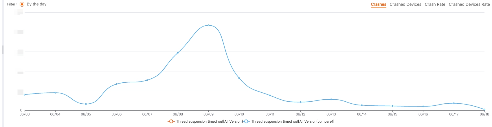

# HuoLaLa unify hook lib

[](https://www.apache.org/licenses/LICENSE-2.0) 

[简体中文](./README_CN.md)

The HuoLaLa and Lalamove Android project employs `inline-hook` techniques to address system-level issues and enhance app's overall stability or performance.

## Thread Shield

### Safe to suspend thread.

Avoid suspending thread timeout to make process kill by `Abort` signal.

```
SuspendThreadSafeHelper.getInstance()
            .suspendThreadSafe(object : SuspendThreadSafeHelper.SuspendThreadCallback {
                override fun suspendThreadTimeout(waitTime: Double) {
                    Log.i("TAG", "Waitting for thread suspend done, spend : $waitTime s")
                }

                override fun onError(errorMsg: String) {
                    Log.e("TAG", "onError: $errorMsg")
                }
            })
```

- Android [5,11] : Hook [ThreadSuspendByPeerWarning()](https://cs.android.com/android/platform/superproject/+/android-9.0.0_r61:art/runtime/thread_list.cc) to modified log level, if hit thread suspend timeout, will call `suspendThreadTimeout()` to notified java side.

- Android [12,14] : Hook [SuspendThreadByPeer()](https://cs.android.com/android/platform/superproject/+/android-12.0.0_r34:art/runtime/thread_list.cc) function and replace it to call SuspendThreadByPeerId() function, will not need to call `suspendThreadTimeout()` to notified java side, because if thread suspend timeout can not send abort signal.

- Android 15 : Hook [StringPrintf()](https://cs.android.com/android/platform/superproject/main/+/main:external/cronet/base/strings/stringprintf.cc;bpv=1;bpt=1) function and block thread to wait thread suspends finish, will call `suspendThreadTimeout()` to notified java side.

#### Earnings

In Lalamove Side, the number of thread suspend timeout crash times is so huge.


