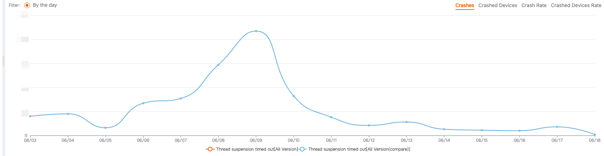

# HuoLaLa unify hook lib

[](https://www.apache.org/licenses/LICENSE-2.0) 

货拉拉 与 Lalamove Android 项目采用`inline-hook`技术来解决系统级问题以提高系统稳定性与性能问题。

## Thread Shield

### 安全的挂起线程(屏蔽超时事件)

避免当挂起超时时，进程被 `Abort` 信号杀死。

```
SuspendThreadSafeHelper.getInstance()
            .suspendThreadSafe(object : SuspendThreadSafeHelper.SuspendThreadCallback {
                override fun suspendThreadTimeout(waitTime: Double) {
                    Log.i("TAG", "Waitting for thread suspend done, spend : $waitTime s")
                }

                override fun onError(errorMsg: String) {
                    Log.e("TAG", "onError: $errorMsg")
                }
            })
```

- Android [5,11] : Hook [ThreadSuspendByPeerWarning()](https://cs.android.com/android/platform/superproject/+/android-9.0.0_r61:art/runtime/thread_list.cc)函数, 将日志致命级别修改为警告级别，如果线程挂起超时，将调用 `suspendThreadTimeout()` 会通知 Java 层。

- Android [12,14] : Hook [SuspendThreadByPeer()](https://cs.android.com/android/platform/superproject/+/android-12.0.0_r34:art/runtime/thread_list.cc) 函数转而调用 [SuspendThreadByThreadIdSuspendThreadByThreadId](https://cs.android.com/android/platform/superproject/+/android-12.0.0_r34:art/runtime/thread_list.cc), 此时并不会回调给 Java 调用方, 因为替换方法不会触发 `Abort` 信号发送，进而不会造成崩溃。

- Android 15 : Hook [StringPrintf()](https://cs.android.com/android/platform/superproject/main/+/main:external/cronet/base/strings/stringprintf.cc;bpv=1;bpt=1) 函数，并且在代理`StringPrintf`中等待线程真正挂起结束后再执行后续流程, 将调用 `suspendThreadTimeout()` 会通知 Java 层，并回调等待时间。

#### 收益

在货拉拉国际版业务中, 由于存在一部分低端设备，线程挂起超时导致的崩溃次数较多，修复后收益明显。


